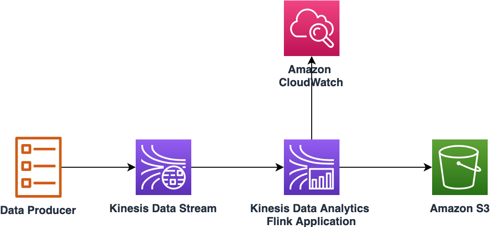

# Amazon Kinesis Data Analytics Flink – Starter Kit

Amazon Kinesis Data Analytics Flink Starter Kit helps you with the development of Flink Application with Kinesis Stream as a source and Amazon S3 as a sink. This demonstrates the use of [Session Window](https://ci.apache.org/projects/flink/flink-docs-stable/dev/stream/operators/windows.html#session-windows) with [AggregateFunction](https://ci.apache.org/projects/flink/flink-docs-stable/dev/stream/operators/windows.html#aggregatefunction).

**Contents:**

* [Architecture](#architecture)
* [Application Overview](#application-overview)
* [Build Instructions](#build-instructions)
* [Deployment Instructions](#deployment-instructions)
* [Testing Instructions](#testing-instructions)
* [Future Releases](#future-releases)

---

## Architecture

The Architecture of this starter kit is shown in the below diagram


## Application Overview

### Pre-requisites

 1. JDK 8
 1. IDE for  e.g. [Eclipse](https://www.eclipse.org/) or [Spring Tools](https://spring.io/tools) or [Intellij IDEA](https://www.jetbrains.com/idea/)
 1. [Apache Maven](https://maven.apache.org/)
 1. [AWS CLI](https://docs.aws.amazon.com/cli/latest/userguide/install-cliv2.html)
 1. This starter kit tested with Apache Flink Version 1.8

---

### AWS Service Requirements

The following AWS services are required to deploy this starter kit:

 1. 1 [Amazon S3](https://aws.amazon.com/s3/)  Bucket
 1. 1 [Amazon Kinesis Data Stream](https://aws.amazon.com/kinesis/data-streams/)
 1. 1 [Amazon Kinesis Data Analytics](https://aws.amazon.com/kinesis/data-analytics/) Flink Application
 1. 1 IAM role with 4 policies

---

## Build Instructions

### Build Apache Flink Connector for Amazon Kinesis

1. Use this command to run the script [build_flink_connector_kinesis.sh](./src/main/resources/build_flink_connector_kinesis.sh)

    ```./build_flink_connector_kinesis.sh PATH_TO_FLINK_SOURCE_CODE 1.8.2 2.11```

1. This will generate ```flink-connector-kinesis_2.11-1.8.2.jar``` under ***PATH_TO_FLINK_SOURCE_CODE/flink-release-1.8.2/flink-connectors/flink-connector-kinesis/target/***
1. When the above step is successfull, below Maven dependency will be resolved properly in [pom.xml](./pom.xml)

    ```xml
    <dependency>
        <groupId>org.apache.flink</groupId>
        <artifactId>flink-connector-kinesis_${scala.binary.version}</artifactId>
        <version>${flink.version}</version>
   </dependency>
    ```

---

### Build Apache Flink Application

 1. Clone this starter kit to your Laptop / MacBook
 1. It has Maven nature, so you can import it to your IDE.
 1. Build the Jar file using one of the steps below:
    1. Using standalone Maven, go to project home directory and run command ```mvn -X clean install```
    1. From Eclipse or STS, run command ```-X clean install```. Navigation: Project right click --> Run As --> Maven Build (Option 4)
 1. Build process will generate a jar file  ```amazon-kinesis-data-analytics-flink-starter-kit-0.1.jar```. Note: The  size  of the jar file is around 38 MB

---

## Deployment Instructions

You can deploy the Starter Kit using either AWS CLI or AWS Console.

### Flink Application Properties

1. The Starter Kit requires the following properties

    | Key   | Value  | Description |
    |-------| -------| ----------- |
    | region  | us-east-1 | AWS region |
    | input_stream_name | kda_flink_starter_kit_kinesis_stream | Input Kinesis Data Stream Name |
    | session_time_out_in_minutes      | 10 | Session timeout in minutes |
    | stream_initial_position | TRIM_HORIZON | Refer documentation [here](https://ci.apache.org/projects/flink/flink-docs-stable/dev/connectors/kinesis.html#configuring-starting-position) for more details |
    | s3_output_path | s3a://<bucket_name>/kda_flink_starter_kit_output | s3 path for Flink Application output |
    | bucket_check_interval_in_seconds | 2 | interval for checking time based rolling policies |
    | rolling_interval_in_seconds      | 2 | the max time a part file can stay open before having to roll |
    | inactivity_interval_in_seconds   | 2 | Sets the interval of allowed inactivity after which a part file will have to roll |

### Using AWS CLI

1. Log onto AWS console and go to S3, select the bucket you will use. If not create a new bucket and go to the bucket
1. Create a folder with name ```kda_flink_starter_kit_jar```
1. Create a folder with name ```kda_flink_starter_kit_output```
1. Open command prompt on your Laptop / MacBook
1. Upload Flink Application Jar file to S3 bucket

    ```bash
    aws s3 cp amazon-kinesis-data-analytics-flink-starter-kit-0.1.jar s3://bucket_name/kda_flink_starter_kit_jar/
    ```

1. Create Kinesis Stream

    ```bash
    aws kinesis create-stream --stream-name kda_flink_starter_kit_kinesis_stream --shard-count 4
    ```

1. Create IAM policies. On your terminal, navigate to folder ***/amazon-kinesis-data-analytics-flink-starter-kit/src/main/resources***

    1. Policy for CloudWatch Logs

        ```bash
        aws iam create-policy --policy-name flink_starter_kit_iam_policy_cloudwatch_logs \
        --policy-document file://flink_starter_kit_iam_policy_cloudwatch_logs.json
        ```

    1. Policy for CloudWatch

        ```bash
        aws iam create-policy --policy-name flink_starter_kit_iam_policy_cloudwatch \
        --policy-document file://flink_starter_kit_iam_policy_cloudwatch.json
        ```

    1. Policy for Kinesis Data Stream

        ```bash
        aws iam create-policy --policy-name flink_starter_kit_iam_policy_kinesis \
        --policy-document file://flink_starter_kit_iam_policy_kinesis.json
        ```

    1. Policy for S3

        ```bash
        aws iam create-policy --policy-name flink_starter_kit_iam_policy_s3 \
        --policy-document file://flink_starter_kit_iam_policy_s3.json
        ```

1. Create an IAM role

    ```bash
    aws iam create-role --role-name flink_starter_kit_role --assume-role-policy-document file://flink_starter_kit_assume-role-policy-document.json
    ```

1. Attach policies to IAM role ```flink_starter_kit_role```. Replace **<1234567890>** with your AWS Account Id before running the commands.

    1. Policy for CloudWatch Logs

        ```bash
        aws iam attach-role-policy --role-name flink_starter_kit_role \
        --policy-arn arn:aws:iam::<1234567890>:policy/flink_starter_kit_iam_policy_cloudwatch_logs
        ```

    1. Policy for CloudWatch

        ```bash
        aws iam attach-role-policy --role-name flink_starter_kit_role \
        --policy-arn arn:aws:iam::<1234567890>:policy/flink_starter_kit_iam_policy_cloudwatch
        ```

    1. Policy for Kinesis

        ```bash
        aws iam attach-role-policy --role-name flink_starter_kit_role \
        --policy-arn arn:aws:iam::<1234567890>:policy/flink_starter_kit_iam_policy_kinesis
        ```

    1. Policy for S3

        ```bash
        aws iam attach-role-policy --role-name flink_starter_kit_role \
        --policy-arn arn:aws:iam::<1234567890>:policy/flink_starter_kit_iam_policy_s3
        ```

1. Open [flink_starter_kit_def_stream_position_trim_horizon.json](./src/main/resources/flink_starter_kit_def_stream_position_trim_horizon.json) and update the following values:
    1. AWS account number in attributes **ServiceExecutionRole** and **LogStreamARN**
    1. S3 bucket name for attribute **BucketARN**
    1. S3 bucket name for parameter **s3_output_path** under **PropertyMaps**
1. Create Log group in CloudWatch Logs

    ```bash
    aws logs create-log-group --log-group-name /aws/kinesis-analytics/kda_flink_starter_kit
    ```

1. Create Log stream in under the Log group

    ```bash
    aws logs create-log-stream --log-group-name /aws/kinesis-analytics/kda_flink_starter_kit \
    --log-stream-name kda_flink_starter_kit
    ```

1. Run this command to create Kinesis Data Analytics Flink application

    ```bash
    aws kinesisanalyticsv2 create-application \
    --cli-input-json file://flink_starter_kit_def_stream_position_trim_horizon.json
    ```

1. Run this command to start the application

    ```bash
    aws kinesisanalyticsv2 start-application \
    --cli-input-json file://flink_starter_kit_start_configuration.json
    ```

---

### Using AWS Console

1. Login to AWS Console
1. Choose or create an S3 bucket to be used to runs this Quick Start
1. Go to the S3 bucket, create a folder called ```kda_flink_starter_kit```
1. Go to the folder and upload the  Jar generated in the previous section
1. Create following IAM policies
   1. IAM policy with name ```flink_starter_kit_iam_policy_s3``` using [Policy summary sample](./src/main/resources/flink_starter_kit_iam_policy_s3.json)
   1. IAM policy with name ```flink_starter_kit_iam_policy_kinesis``` using [Policy summary sample](./src/main/resources/flink_starter_kit_iam_policy_kinesis.json)
   1. IAM policy with name ```flink_starter_kit_iam_policy_cloudwatch``` using [Policy summary sample](./src/main/resources/flink_starter_kit_iam_policy_cloudwatch.json)
   1. IAM policy with name ```flink_starter_kit_iam_policy_cloudwatch_logs``` using [Policy summary sample](./src/main/resources/flink_starter_kit_iam_policy_cloudwatch_logs.json)
1. Create an IAM role with name ```kda_flink_starter_kit``` and attach above policies
1. Create a Kinesis Data Stream
    1. Name = ```kda_flink_starter_kit_kinesis_stream```
    1. Number of shards = ```6```
1. Create Kinesis Data Analysis Application as follows:
    1. Application name = ```amazon_kda_flink_starter_kit```
    1. Runtime = Apache Flink. Select version 1.8
1. Click on Configure
    1. Amazon S3 bucket = Choose the bucket you selected in Step # 2
    1. Path to Amazon S3 object = must be the prefix for ```amazon-kinesis-data-analytics-flink-starter-kit-0.1.jar```
    1. Under section **Access to application resources** select ***Choose from IAM roles that Kinesis Data Analytics can assume***
    1. IAM role = Choose the IAM role created above
    1. Using the Jar file generated in the above step
    1. Select the Runtime as Flink 1.8
    1. IAM role = ```the IAM role created above```
    1. Snapshot = Enable
    1. Monitoring -> Monitoring metrics level = Parallelism
    1. Monitoring -> Monitoring with CloudWatch Logs -> Enable, Monitoring log level = Info
    1. Scaling -> Parallelism = 10, Parallelism per KPU = 1
1. Under Properties, click on Add group and provide the  **Group ID** as ```FlinkAppProperties```. Create properties defined in the section [Flink Application Properties](#flink-application-properties)

---

## Testing Instructions

You can use [Amazon Kinesis Data Analytics Flink – Benchmarking Utility](https://github.com/aws-samples/amazon-kinesis-data-analytics-flink-benchmarking-utility) to generate sample data, test Apache Flink Session Window, and to prove the architecture of this starter kit.

---

## Future Releases

The future releases of this starter kit will include the following features

1. Add example(s) for Event Time / Processing Time based streaming application. Refer Apache Flink [documentation](https://ci.apache.org/projects/flink/flink-docs-release-1.8/dev/event_time.html) for more details.

Contributions are welcome, refer [CONTRIBUTING.md](https://github.com/aws-samples/amazon-kinesis-data-analytics-flink-starter-kit/blob/master/CONTRIBUTING.md) for more details.

---

## License Summary

This sample code is made available under the MIT license. See the LICENSE file.
